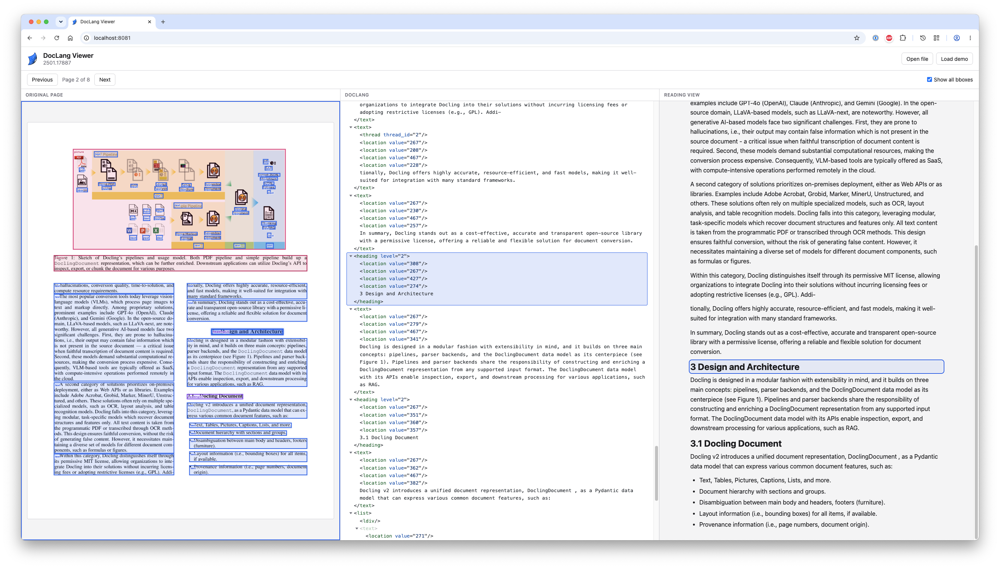

# DocLang Viewer

Browser-based viewer for DocLang markup and [archives](https://github.com/doclang-project/doclang/blob/main/spec.md#doclang-archive-format): a reading view, formatted markup, and—when opening an archive with page images—original pages with linked selection and bounding-box overlays.

Standalone `.dclg` or `.xml` files show markup and the reading view only. `.dclx` archives may also include page images and assets; layout and page-alignment rules are in the [DocLang specification](https://github.com/doclang-project/doclang) ([archive format section](https://github.com/doclang-project/doclang/blob/main/spec.md#doclang-archive-format)).



## Quick start

Serve this directory over HTTP so the demo can fetch example files:

```bash
python3 -m http.server 8080
```

Open [http://localhost:8080/](http://localhost:8080/) and click **Load demo**.

## Opening files

| Action | Description |
|--------|-------------|
| **Load demo** | Fetches [`assets/2501.17887.dclx`](assets/2501.17887.dclx) (requires HTTP). |
| **Open file** | Select a `.dclx` archive, or a standalone `.dclg` / `.xml` markup file. |
| **Drag and drop** | Drop any supported file onto the page. |

Supported types: `.dclx`, `.dclg`, `.xml`. The demo URL is configured in [`demo-data.js`](demo-data.js).

## Files

- `demo-data.js` — demo archive URL
- `index.html` — shell UI
- `viewer.js` — parsing, page alignment, bbox overlay
- `viewer.css` — layout and theme
