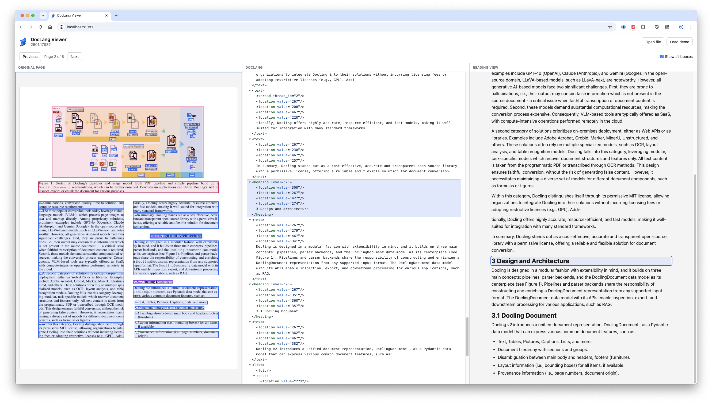

# DocLang Viewer

Browser-based viewer for DocLang markup and [archives](https://github.com/doclang-project/doclang/blob/main/spec.md#doclang-archive-format): a reading view, formatted markup, and—when opening an archive with page images—original pages with linked selection and bounding-box overlays.

Standalone `.dclg` or `.xml` files show markup and the reading view only. `.dclx` archives may also include page images and assets; layout and page-alignment rules are in the [DocLang specification](https://github.com/doclang-project/doclang) ([archive format section](https://github.com/doclang-project/doclang/blob/main/spec.md#doclang-archive-format)).



## Quick start

Serve this directory over HTTP so the demo can fetch example files:

```bash
python3 -m http.server 8080
```

Open [http://localhost:8080/](http://localhost:8080/) and click **Load demo**.

## Opening files

| Action | Description |
|--------|-------------|
| **Load demo** | Fetches [`assets/2501.17887.dclx`](assets/2501.17887.dclx) (requires HTTP). |
| **Open file** | Select a `.dclx` archive, or a standalone `.dclg` / `.xml` markup file. |
| **Drag and drop** | Drop any supported file onto the page. |
| **From another page** | A page that opens the viewer can hand it a file; see [Opening from another page](#opening-from-another-page). |

Supported types: `.dclx`, `.dclg`, `.xml`. The demo URL is configured in [`demo-data.js`](demo-data.js).

### Opening from another page

Tools that produce DocLang in the browser, such as the [docling-serve](https://github.com/docling-project/docling-serve) UI, can open the viewer with a document already loaded. The file is passed with `postMessage`, so it never needs a public URL:

1. Open the viewer in a new window with `?source=opener` (the demo is then not loaded), keeping the returned window handle.
2. Post `{type: "doclang-viewer:ping"}` to it, repeating until the viewer answers `{type: "doclang-viewer:ready"}`.
3. Post `{type: "doclang-viewer:open", name, buffer}`, where `buffer` is the file as an `ArrayBuffer` and `name` its file name (for example `report.dclx`).

```js
const viewer = window.open("https://doclang.ai/viewer/?source=opener", "_blank");
const origin = "https://doclang.ai";
const ping = setInterval(() => viewer.postMessage({ type: "doclang-viewer:ping" }, origin), 250);
window.addEventListener("message", (event) => {
  if (event.source !== viewer || event.data?.type !== "doclang-viewer:ready") return;
  clearInterval(ping);
  viewer.postMessage({ type: "doclang-viewer:open", name: "report.dclx", buffer }, origin, [buffer]);
});
```

The viewer only accepts these messages from the window that opened it.

## Files

- `demo-data.js` — demo archive URL
- `index.html` — shell UI
- `viewer.js` — parsing, page alignment, bbox overlay
- `viewer.css` — layout and theme
- `vendor/katex/` — vendored [KaTeX](https://katex.org/) (MIT, see [`vendor/katex/LICENSE`](vendor/katex/LICENSE)), used to render `<formula>` LaTeX in the reading view
- `validator-worker.mjs` — XSD validation in a Web Worker, equivalent to `doclang validate --xsd-only -n`
- `schema/doclang.xsd` — copy of the DocLang XSD from the [doclang](https://github.com/doclang-project/doclang) repo (`doclang/doclang.xsd`, version 0.7.3)
- `vendor/libxml2-wasm/` — vendored [libxml2-wasm](https://github.com/jameslan/libxml2-wasm) (MIT, see [`vendor/libxml2-wasm/LICENSE`](vendor/libxml2-wasm/LICENSE)), libxml2 compiled to WebAssembly, used for validation
