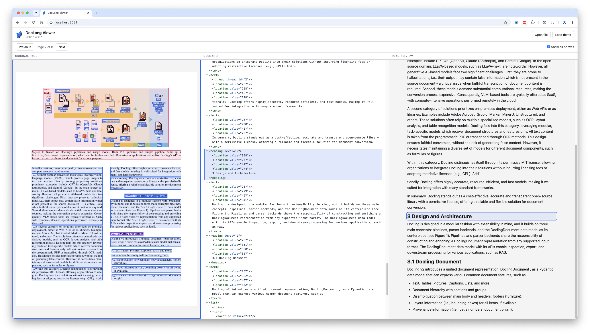

# DocLang Viewer

Browser-based viewer for DocLang markup and [archives](https://github.com/doclang-project/doclang/blob/main/spec.md#doclang-archive-format): a preview, the formatted DocLang, and—when opening an archive with page images—the original pages with linked selection and bounding-box overlays.

The preview is **Flowing** (the content in reading order) or **Paged** (each element in its place on the page). A page with nothing placed on it, e.g. from a model asked for some tasks only, flows inside the page in the Paged Preview, and its header says so (**No locations · flowing**).

Standalone `.dclg` or `.xml` files show the DocLang and the preview only. `.dclx` archives may also include page images and assets; layout and page-alignment rules are in the [DocLang specification](https://github.com/doclang-project/doclang) ([archive format section](https://github.com/doclang-project/doclang/blob/main/spec.md#doclang-archive-format)).



## Quick start

Serve this directory over HTTP so the demo can fetch example files:

```bash
python3 -m http.server 8080
```

Open [http://localhost:8080/](http://localhost:8080/): the demo loads on its own.

## Opening files

| Action | Description |
|--------|-------------|
| **Demo** | Fetches the demo archives, [`assets/2501.17887.dclx`](assets/2501.17887.dclx) and [`assets/artemis.dclx`](assets/artemis.dclx) (requires HTTP), when the viewer opens without a file (**Show demo on launch** in Settings), or from **load demo** on the start screen, in place of the open files. |
| **Open** (⌘O / Ctrl+O) | Select a `.dclx` archive, or a standalone `.dclg` / `.xml` markup file; it opens next to the files already open. |
| **Drag and drop** | Drop any supported file onto the page. |
| **From another page** | A page that opens the viewer can hand it a file; see [Opening from another page](#opening-from-another-page). |
| **In another page** | A page that embeds the viewer can show its own documents in it, also while it is still writing them; see [Embedding in a page](#embedding-in-a-page). |

Supported types: `.dclx`, `.dclg`, `.xml`. The demo URLs are configured in [`demo-data.js`](demo-data.js).

**Download** saves the open file, with any applied edits. When an archive carries its [original source](https://github.com/doclang-project/doclang/blob/main/spec.md#original-source-optional) (e.g. the PDF it was converted from), it also offers that **Original file**, under the name its source descriptor records.

### Opening from another page

Tools that produce DocLang in the browser, such as the [docling-serve](https://github.com/docling-project/docling-serve) UI, can open the viewer with a document already loaded. The file is passed with `postMessage`, so it never needs a public URL:

1. Open the viewer in a new window with `?source=opener` (the demo is then not loaded), keeping the returned window handle.
2. Post `{type: "doclang-viewer:ping"}` to it, repeating until the viewer answers `{type: "doclang-viewer:ready"}`.
3. Post `{type: "doclang-viewer:open", name, buffer}`, where `buffer` is the file as an `ArrayBuffer` and `name` its file name (for example `report.dclx`).

```js
const viewer = window.open("https://doclang.ai/viewer/?source=opener", "_blank");
const origin = "https://doclang.ai";
const ping = setInterval(() => viewer.postMessage({ type: "doclang-viewer:ping" }, origin), 250);
window.addEventListener("message", (event) => {
  if (event.source !== viewer || event.data?.type !== "doclang-viewer:ready") return;
  clearInterval(ping);
  viewer.postMessage({ type: "doclang-viewer:open", name: "report.dclx", buffer }, origin, [buffer]);
});
```

The viewer only accepts these messages from the window that opened it.

### Embedding in a page

A page can embed the viewer in an `<iframe>` and show its own documents in it, for example a conversion it runs, while the model is still writing it. Open the viewer with `?source=embed` and use the same handshake as above, with the embedding page in place of the opener: post `{type: "doclang-viewer:ping"}` until the viewer answers `{type: "doclang-viewer:ready"}`. The viewer only accepts messages from the page that embeds it. Then:

| Message | What it does |
|---------|--------------|
| `{type: "doclang-viewer:show", name, markup, pages, tokens, complete}` | Shows `markup` (DocLang, as a string) with its page images, `pages` as `{[pageNo]: Blob \| ArrayBuffer}`. Posting `show` again with the same `name` replaces the document, so the page can show it while it is still being written. `tokens` (optional) are the tokens the model generated, `[[text, id, special], …]` in order; the token views show them in place of the viewer's own tokenizer. `complete: true` says the document is done. Until then, `markup` can be cut off anywhere, as the model wrote it so far: the viewer closes what is still open. |
| `{type: "doclang-viewer:configure", theme, style, accept}` | Fits the viewer into the page: `theme` (`"light"` or `"dark"`) over the user's choice, `style` sets the viewer's colour variables (e.g. `{"--bg": "#f3ede2"}`; other names, and values that could load something, are ignored), `accept` lists extensions of files the page takes itself (e.g. `[".png", ".pdf"]`). |
| `{type: "doclang-viewer:open", name, buffer}` | Opens a file, as from an opener. |

A file of a type in `accept` that the user drops or opens in the viewer goes to the embedding page, as `{type: "doclang-viewer:file", name, buffer}`; the start screen lists those types next to the viewer's own.

While a shown document is not complete:

- the Raw view shows the markup as written; the other views show it with what is still open closed (a host can also send it closed itself);
- the views follow its end: the page being written becomes the current page, and the DocLang pane keeps its last written line in view (scrolled away, it stays);
- with tokens on, it traces itself as it grows: the Original is veiled but for what is written, the Paged Preview is built up as it is written, and the element being written is highlighted;
- it is not validated: validation runs once it is complete.

A shown document has no trace playback, also once complete: it was traced as it was written.

The URL can also set what the viewer shows, for that visit only (the stored layout is left as it is):

| Parameter | |
|-----------|--|
| `panes` | the panes to show, from `file`, `page`, `markup`, `reading`, e.g. `panes=markup,reading` |
| `reading` | the reading layout, `paged` or `pageless` |
| `header` | `hide` leaves out the header, for a page that brings its own |

with the [features](#features-per-deployment) as usual, e.g.:

```html
<iframe src="https://doclang.ai/viewer/?source=embed&panes=page,markup,reading&header=hide&editing=never&tokens=on"></iframe>
```

## Features per deployment

Each feature is in one of four modes:

| | the user can switch it | the user cannot |
|---|---|---|
| **on** | `on` (starts on) | `always` |
| **off** | `off` (starts off) | `never` (the feature is not there) |

| feature | what | built-in |
|---|---|---|
| `editing` | visual and source editing (inspector, bbox handles, add/remove, drag to reorder, the Raw view, save) | `on` |
| `editing.ocr` | "Read from page" with Granite-Docling in the browser (downloads about 1.2 GB on first use); only while editing is on | `always` |
| `tokens` | tokens in the DocLang source, token tracing, and the Tokens overlays | `off` |
| `demo` | the demo when the viewer opens without a file (not when it opens with one); `never` also drops **load demo** from the start screen | `on` |
| `stream` | documents a host [streams in](#embedding-in-a-page) while they are written: the viewer closes their unfinished markup and shows where they are being written | `always` |

A deployment overrides what it needs by replacing [`config.js`](config.js); features it doesn't mention keep their built-in mode:

```js
window.DOCLANG_CONFIG = { features: { tokens: "always", "editing.ocr": "never" } };
```

`editing`, `tokens` and `demo` have a switch in Settings when they are `on` or `off`; the user's choice is remembered (per deployment path). `editing.ocr` has no switch of its own, so for it `on` means `always` and `off` means `never`. A child like `editing.ocr` is not there when its parent isn't.

For a single visit, the URL can set a feature's mode with the same words, e.g. `?tokens=on` or `?editing=never` (a read-only link). It cannot change an `always` from the config except to `never`, nor bring back a `never`. `on`/`off` from the URL leave the remembered choice as it is; switching the feature in Settings drops its parameter from the address, so a reload keeps the user's choice.

## Files

- `config.js` — per-deployment features (see above)
- `demo-data.js` — demo archive URL
- `index.html` — shell UI
- `viewer.js` — parsing, page alignment, bbox overlay
- `viewer.css` — layout and theme
- `vendor/katex/` — vendored [KaTeX](https://katex.org/) (MIT, see [`vendor/katex/LICENSE`](vendor/katex/LICENSE)), used to render `<formula>` LaTeX in the reading view
- `validator-worker.mjs` — XSD validation in a Web Worker, equivalent to `doclang validate --xsd-only -n`
- `schema/` — vendored DocLang XSDs from the [doclang](https://github.com/doclang-project/doclang) repo, one per minor version (`doclang-0.7.xsd` = v0.7.4, `doclang-0.8.xsd` = v0.8.1, `doclang-0.9.xsd` = v0.9.1, `doclang-0.10.xsd` = v0.10.1), indexed by `versions.json`. A document is validated against the schema of the `version` it declares, or the default (latest) one if it declares none. Refresh them with `scripts/vendor-schemas.sh` (add new release tags to its `TAGS` list).
- `vendor/libxml2-wasm/` — vendored [libxml2-wasm](https://github.com/jameslan/libxml2-wasm) (MIT, see [`vendor/libxml2-wasm/LICENSE`](vendor/libxml2-wasm/LICENSE)), libxml2 compiled to WebAssembly, used for validation
- `vendor/lucide/` — license of [Lucide](https://lucide.dev) (ISC, see [`vendor/lucide/LICENSE`](vendor/lucide/LICENSE)), whose undo / redo icons are inlined in `index.html` and image icon in `viewer.js`
